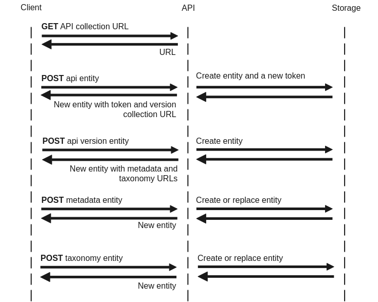

Apimap.io API
=====

🥳 **Happy Coding** 🥳

This section is targeted to developers that want to communicate with the API directly. 

## Table of Contents

* [Introduction](#introduction)
* [Getting Started](#getting-started)
* [Common Workflows](#common-workflows)
* [MongoDB Setup](MONGODB.md)
* [Other Resources](#other-resources)

## Introduction

## Getting Started

### Build and Run

Based on Spring Boot, all the usual targets exist. The easiest way to get started is using **bootRun**

> gradlew bootRun

#### Build JAR

Based on Spring Boot, all the usual targets exist. The easiest way to build the artifacts is using **build**

> gradlew build

#### Build Docker Image

Building the Docker Image is a two-step process based on the [official Spring Boot documentation](https://docs.spring.io/spring-cloud-dataflow-admin-cloudfoundry/docs/1.2.x/reference/html/_deploying_docker_applications.html
). Fist we have to unpack the jar file, then build the image itself.

> **Step 1:** mkdir -p build/dependency && (cd build/dependency; cp ../libs/api-1.4.2.jar .; jar -xf api-1.4.2.jar)

> **Step 2:** docker build -t apimap/api .

#### Requirements

Each node need a persistent storage volume. Default location is '/var/apimap'

```shell script
docker volume create apimap-data
```

## Common Workflows
___
The following workflows are the most frequently used and builds the primary functionality provided by the API. All URLs
needed is provided by the API dynamically, please do not hardcode any absolute URLs except the root url to your instance.

Each data entity and resource/collection is describen in the coresponding [OpenAPI Specification](swagger.json)


### Create an API and first-time upload of files
> This workflow contains every action needed to create an API, an API version and upload the metadata and/or taxonomy 
> files.



#### Steps
1. Create an API based on the "api:collection" URL return from the root path
2. Create a new API version based on the returned collection from step 1 (using the token returned from step 1)
3. Upload the metadata content to the URL returned from step 2 (using the token returned from step 1)
4. Upload the taxonomy content to the URL returned from step 2 (using the token returned from step 1)

⚠️**Important** ⚠️Please note that the token returned in step 1 must be safely stored and used with every future request to the API.

### Delete an API
> It is possible to delete everything associated with an API or just a specific API version.

#### Steps
1. Get the "api:collection" URL return from the root path
2. Find the URL to the resource detailed in the links → self string
3. Perform a "DELETE" on that URL

This will remove all information associated with the URL (including metadata and taxonomy)

### Update metadata and/or taxonomy files
> Performing a PUT on the metadata or taxonomy resource will replace all of its content

1. Get the "api:collection" URL return from the root path
2. Find the URL to the resource detailed in the relationships → version:collection → links → self string
3. Find the required version to updated and follow the URL detailed in links → self
4. To update the metadata perform a PUT on the resource detailed in links → related → ref = "metadata:collection" → href
5. To update the classifications perform a PUT on the resource detailed in links → related → ref = "classification:collection" → href 

## API Errors

When errors occure the server will respond with a status code and a json. The json has the error object array and contain multiple feedbacks to explain what failed.

```json
{
  "links":{},
  "meta":{},
  "jsonapi":{
    "version":"1.1"
  },
  "errors":[
    {
      "status":"409 CONFLICT",
      "title":"The resource exists already"
    }
  ]
}
```


## Other Resources
___

- [Hypermedia as the Engine of Application State (HATEOAS) ](https://en.wikipedia.org/wiki/HATEOAS)
- [JSON:API — A specification for building APIs in JSON](https://jsonapi.org/)